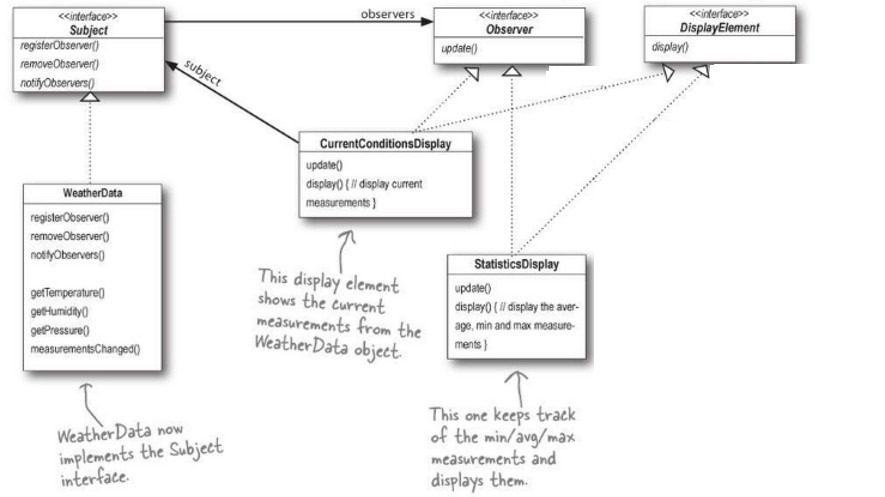

# Exam: Completing the Observer Pattern in WeatherStation

## Description

In this exam, we will complete a Weather station service, which constantly send weather data its subscribers. The service is implemented via Observer Design Pattern. The architecture is shown below:



The key elements in the design are:
- *WeatherStation.java*: The main test file.
- *Subject.java*: Add / remove observers to an internal array 
- *Observer.java*: Observer interface.
- *DisplayElement.java*: Display interface.

The other two files *StatisticsDisplay.java* and *CurrentConditionDisplay.java* implement the observer and display interface.
The code was adapted from [Head First Design Pattern](https://github.com/bethrobson/Head-First-Design-Patterns). 


## Objective

You need to complete the 3 functions in *Subject.java*:

```java

public void registerObserver(Observer o) { }
	
public void removeObserver(Observer o) { }
	
public void notifyObservers() { }

```

## Expected Output

The output example of the *CurrentConditionsDisplay* is:

```
Current conditions: 80.0F degrees and 65.0% humidity
```


The *StatisticsDisplay* shows the average, max and min temperatue. The output example is shown below: 
```
Avg/Max/Min temperature = 81.0/82.0/80.0
```


